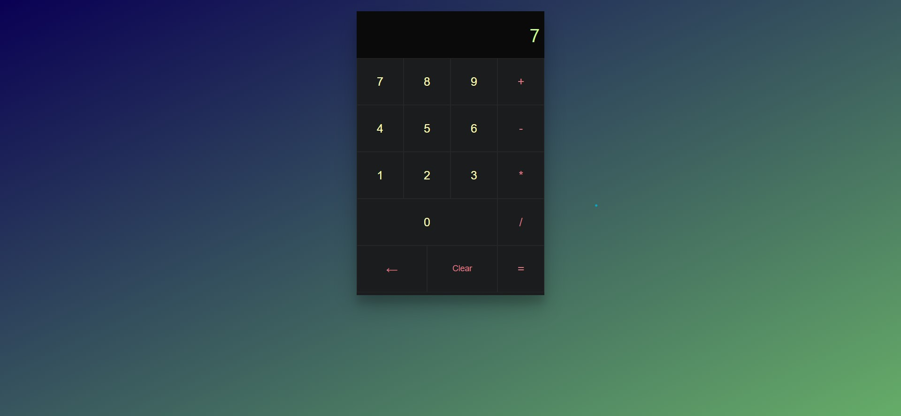

### CalCuladora hecha con REACT
Es una calculadora básica implementada usando React, se abrdan conceptos clave como variables, eventois, clases, somponentes y fucniones, asi mismo se asimilan conceptos se html, js y html, de los cuales parte todo un serie de aplicacion de React mismo que se base en EmmaS5
## Iniciando 🛫🛫
- Para iniciar se recomienda instalar unaverison estable de node (>14), particularmente este proyecto se desplegó usando la version *16.12.2* 
- A continuiación, se recomienda instalar la paqueteria usada en este proyecto:
```
npm i 
npm install
```
-Finalmente usar :
```
npm start
```
## Previsualización
