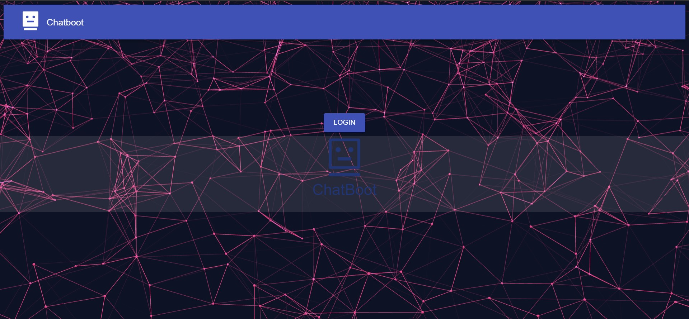

# Login and Logout con Chatboot hecho en REACT
Es una interfaz funcional en la que el usuario puede iniciar sesion poor varios medio como correo o asociar su cuenta de Google, para ello se utiliza los servicio de de zeroauth,  mismo que sirve como mediador entre la UI y la logica de Login para facilidtar el uso de informacion de la cuenta.
Ademas cuenta con un ChatBaoout sumamente basico con el que se puede interectuar brevemente.
Para la UI y efectos visuales se utilizo libreria como [vanta js](https://www.vantajs.com/) 
## Previsualizacion
- Inicio

- Login
 
- ChatBoot 🤖

